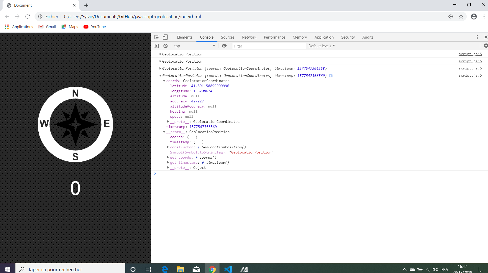

# Javascript30 Tutorial Geolocation

* Wes Bos Youtube Tutorial: [JavaScript Geolocation based Speedometer and Compass - #JavaScript30 21/30](https://www.youtube.com/watch?v=X7Cbtra0C6I&index=21&list=PLu8EoSxDXHP6CGK4YVJhL_VWetA865GOH).

*** Note: to open web links in a new window use: _ctrl+click on link_**

## Table of contents

* [General info](#general-info)
* [Screenshots](#screenshots)
* [Technologies](#technologies)
* [Setup](#setup)
* [Features](#features)
* [Status](#status)
* [Inspiration](#inspiration)
* [Contact](#contact)

## General info

* Tutorial app to show geolocation and speed, tutorial 21 from Wes Bos Javascript30 course

## Screenshots

.

## Technologies

* [Javascript v1.9 ECMA-262 ECMAScript 2018](http://www.ecma-international.org/publications/standards/Ecma-262.htm)

## Setup

* Open index.html in browser. If any code is changed the browser needs to be refreshed.

## Code Examples

* geolocation used to get coordinates and speed:

```javascript
navigator.geolocation.watchPosition((data) => {
  console.log(data);
  speed.textContent = Math.round(data.coords.speed);
  arrow.style.transform = `rotate(${data.coords.heading}deg)`;
}, (err) => {
  console.err(err);
});
```
## Features

* Needs a simulator to test the speed indicator.

## Status & To-Do List

* Status: Working. Updated to work from browser, not from Glitch.

* To-Do: can be enhanced to show more information on location etc. on the screen, not just using console.log. 
Options could be changed, to show miles per hour instead of km/h etc.

## Inspiration

* [JavaScript Geolocation based Speedometer and Compass - #JavaScript30 21/30](https://www.youtube.com/watch?v=X7Cbtra0C6I&index=21&list=PLu8EoSxDXHP6CGK4YVJhL_VWetA865GOH)

## Contact

Repo created by [ABateman](https://www.andrewbateman.org) - feel free to contact me!